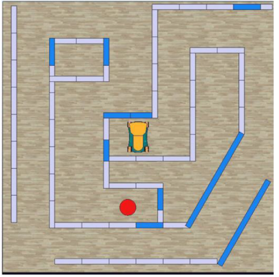

# Proyecto de ICI4247-1 	INGENIERIA WEB Y MOVIL

## Integrantes:
- Gerald Espinoza
- Lucas Robles

## Idea
Este proyecto se realiza en conjunto con el proyecto del ramo **ICI4150-1 ROBOTICA Y SISTEMAS AUTONOMOS** y fue seleccionada la propuesta de Proyecto 2: 
~~~
Se requiere un robot autónomo que pueda recorrer el siguiente laberinto, donde el robot pueda encontrar la salida. El camino debe tener en cuenta las limitaciones del vehículo para evitar colisiones. Al completar el laberinto, tu robot debería celebrar girando dos veces en el sentido de las agujas del reloj y luego dos giros en el sentido contrario a las agujas del reloj. La meta está marcada por el círculo rojo. Para aproximaciones de distancia, todos los bloques grises miden 50 cm * 10 cm.
~~~

# Primera Entrega Parcial

- EP1.1 Análisis y diseño de funcionalidades (al menos 5).
- EP1.2 Prototipado en Figma de al menos 5 UI (pantallas), que representen las funcionalidades propuestas. Se deben considerar 5 funcionalidades y diseños diferentes, y las UI deben ser prototipadas utilizando interfaces móviles
- EP1.3 Maquetación responsiva de las 5 UI utilizando HTML y CSS. Se puede utilizar preprocesadores de CSS, o librerías de diseño como Bootstrap o Tailwind CSS.
- EP1.4 Incluír dos formularios relacionados a la sesión de usuarios (inicio de sesión y registro), considerando los campos: Nombre de usuario (username), RUT, Correo Electrónico (email), Región, Comuna, Contraseña, Confirmación de contraseña y Aceptación de términos y condiciones.
- EP1.5 Implementar un mecanismo de validación de formularios, utilizando JavaScript, y mostrando mensajes de error en caso de que los campos no cumplan con las reglas de validación.

## Funcionalidades:

1. Menú: Un menú en forma de bar que se encuentre en todas las pantallas, con diseño minimalista e intuitivo, para navergar por las funcionalidades de la aplicación.

2. Registro de Usuario: Una de las 2 funcionalidades relacionadas a la sesión del usuario. Consiste en espacios de input para insertar los datos requeridos, un boton para registrar un nuevo usuario en la aplicación con esos datos y otro boton para registrarse con su cuenta Google.

3. Inicio de sesión: Una de las 2 funcionalidades relacionadas a la sesión del usuario. En esta solo habra 2 input para verificar el usuario y 2 botones, uno con los datos ingresados y otro con su cuenta Google

4. Control Remoto del Robot: Funcion que busca permitir al usuario mover al robot con un control remoto que se mostraria en pantalla, que consiste en las flechas de movimiento y un boton para celebrar donde el robot realizara movimientos pre-programados a modo de celebración.

5. Recorrer el laberinto: 
    - Pantalla donde se puede iniciar la funcion principal del robot, un boton para indicarle al robot que esta en un laberinto y debe salir de manera autonoma.
    - Mientra el robot se mueve por su cuenta sale un icono de carga y el boton presionado se torna rojo, siendo ahora un boton para detener al robot. 
    - Al presionar el boton rojo, el robot cesa su movimiento autonomo y se muestra en pantalla lo que el robot ha mapeado del laberinto.

## Prototipo Figma:
https://www.figma.com/file/tohZZDbyGVSBx4Ei6HKVq6/Web-y-Robotica?type=design&node-id=1%3A3&mode=design&t=3yznKTGzGxYGXfRy-1 (Temporalmente)